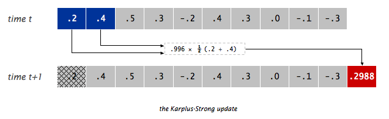

* TOC
{:toc}

Getting the Skeleton Files
--------------------------------

As usual `git pull skeleton master` to get the starting files.

Note that for this homework, unlike the earlier projects, we'll be providing
lots of starter code for you to fill in.

Introduction
--------------------------------

In this homework, we will create a **package** for generating synthesized musical
instruments. You will learn how to write and use packages, as
well as get some hands-on practice with interfaces. We'll also get an
opportunity to implement a simple data structure as well as an algorithm that's
easy to implement using that data structure. Finally, we'll add support for
iteration and exceptions to our data structure.

### Packages

A package is a collection of Java classes that all work together towards some
common goal. We've already seen packages in 61B without knowing it. For example,
`org.junit` is a package that contains various classes useful for testing,
including our familiar `Assert` class, which contains useful static methods like
`assertEquals`. In other words, when we saw `org.junit.Assert.assertEquals`, the
`org.junit` was the package name, `Assert` was the class name, and
`assertEquals` was the method name. We call `org.junit.Assert.assertEquals` the
"canonical name" of the method, and we call `assertEquals` the "simple name" of
the method.

When creating a package, we specify that code is part of a package by specifying
the package name at the top of the file using the package keyword. For example,
if we wanted to declare that a file is part of the `es.datastructur.synthesizer`
package, we'd add the following line to the top of the file.

```java
package es.datastructur.synthesizer;
```

If a programmer wanted to use a class or method from our
`es.datastructur.synthesizer` package, they would have to either use the full
canonical name, e.g. `es.datastructur.GuitarString`, or alternately use `import
es.datastructur.GuitarString`, at which point they could just use the simple
name `GuitarString`.

Typically, package names are the internet address of the entity writing the
code, but backwards. For example, the JUnit library is hosted at `junit.org`, so
the package is called `org.junit`. 

Why are packages useful? It all boils down to that word "canonical". As long as
no two programmers use the same package name for their package, we can freely
use the same class name in several different contexts. For example, there might
exist a class called `com.hrblock.TaxCalculator`, which is different from
`com.turbotax.TaxCalculator`. Given the requirement to either use the full
canonical name or to use an import, this means we'll never accidentally use one
class when we meant to use the other.

Conceptually, you can think of packages as being similar to different folders on
your computer. When you are building a large system, it is a good idea to
organize it into different packages.

From this point forwards, most of our code in 61B will be part of a package.

### The Synthesizer Package

The `es.datastructur.synthesizer` package has three primary components:

- `BoundedQueue`, an interface which declares all the methods that must be
  implemented by any class that implements `BoundedQueue`.
- `ArrayRingBuffer`, a class which implements `BoundedQueue` and uses an
  array as its underlying structure.
- `GuitarString`, a class which uses an `ArrayRingBuffer<Double>` to implement the
  [Karplus-Strong algorithm](http://en.wikipedia.org/wiki/Karplus%E2%80%93Strong_string_synthesis)
  to synthesize a guitar string sound.

We've provided you with skeleton code for `ArrayRingBuffer` and `GuitarString`,
but you'll need to implement the `BoundedQueue` interface from scratch. In this
HW, we'll work our way down the hierarchy from most abstract to most concrete.

Task 1: BoundedQueue
--------------------------------

#### Review: What is an Interface?  Why would you want one?

As discussed in class, an interface is a formal contract between a class and the
outside world.  If your class claims to implement an interface, then all methods
defined by that interface must appear in your class (or somewhere in your
superclass) before the class will successfully compile.  This is a way of
enforcing promised behavior.  All methods that you declare in an interface are
automatically public and abstract (even if you omit the `public` keyword).

####  Your Task

We will start by defining a `BoundedQueue` interface. The `BoundedQueue` is similar
to our `Deque` from Project 1, but with a more limited API. Specifically, items
can only be enqueued at the back of the queue, and can only be dequeued from the
front of the queue. Unlike our Deque, the `BoundedQueue` has a fixed capacity, and
nothing is allowed to enqueue if the queue is full.

<!--acts like a [line (or queue)](https://books.google.com/books?id=fZw39RoyTkcC&pg=PA127&lpg=PA127&dq=%22wait+on+line%22+%22wait+in+line%22+queue&source=bl&ots=g1WMBEBmG-&sig=Vk_AO1OT7dVAH57P6eJa6A1qGCM&hl=en&sa=X&ei=If3pVMX_A5fVoAT46ILYDg&ved=0CB0Q6AEwADgK#v=onepage&q=%22wait%20on%20line%22%20%22wait%20in%20line%22%20queue&f=false) in a super market.-->

Create a file `BoundedQueue.java` in the `es.datastructur.synthesizer` folder.
You can do this easily in IntelliJ by right-clicking on the
`es.datastructur.synthesizer` folder in the project structure sidebar and click
New &rarr; Java Class. Be sure to set "Kind" to "Interface". 

Your `BoundedQueue` interface should contain the following methods:

```java
int capacity();     // return size of the buffer
int fillCount();    // return number of items currently in the buffer
void enqueue(T x);  // add item x to the end
T dequeue();        // delete and return item from the front
T peek();           // return (but do not delete) item from the front
```

You should also create default methods `isEmpty()` and `isFull()` that return
the appropriate answer if the BoundedQueue is empty or full.

```java
default boolean isEmpty()       // is the buffer empty (fillCount equals zero)?
default boolean isFull()        // is the buffer full (fillCount is same as capacity)?
```

For example, given an empty `BoundedQueue<Double>` of capacity 4, the state of
the queue after each operation is shown below:

```java
isEmpty()       //                       (returns true)
enqueue(9.3)    // 9.3
enqueue(15.1)   // 9.3  15.1
enqueue(31.2)   // 9.3  15.1  31.2
isFull()        // 9.3  15.1  31.2       (returns false)
enqueue(-3.1)   // 9.3  15.1  31.2  -3.1
isFull()        // 9.3  15.1  31.2  -3.1 (returns true)
dequeue()       // 15.1 31.2  -3.1       (returns 9.3)
peek()          // 15.1 31.2  -3.1       (returns 15.1)
```

Of course, your `BoundedQueue.java` file won't actually do anything (since it's
an interface), but it will define the contract that any `BoundedQueue` implementing class must
follow.

Make sure to declare this interface as part of the `es.datastructur.synthesizer`
package.  As noted above, the syntax for declaring yourself to be part of a
package is `package <packagename>;`.  For example, if you are part of the
`animal` package, the top of your file should have a `package animal;` line.
Your package name should say `es.datastructur.synthesizer`, nothing else. (If
you created the file using IntelliJ, this should have already been done for
you.)

Before moving on, ensure that there are no compilation errors in `BoundedQueue`.

If you're stuck, see [the List61B
interface](https://github.com/Berkeley-CS61B/lectureCode/blob/7a8b1af0bd5472d732fe9fbb95685830c00295ca/inheritance1/DIY/List61B.java)
for an example of an interface declaration with generics.

Task 2: ArrayRingBuffer
--------------------------------

The `ArrayRingBuffer` class will do all the real work by implementing
`BoundedQueue`. That means we can happily inherit `isEmpty()`, and `isFull()`
without having to override these, but we'll need to override all of the abstract
methods. In this part, you'll fill out `ArrayRingBuffer.java`, which will use an array to represent the queue and the elements in it. 

A naive array based implementation of a `BoundedQueue` would store the newest item at
position 0, the second newest item in position 1, and so forth. This is an
inefficient approach, as we see in the example below, where the comments show
entries 0, 1, 2, and 3 of the array respectively. We assume that the array is
initially all nulls.

```java
BoundedQueue x = new NaiveArrayBoundedQueue(4);
x.enqueue(33.1) // 33.1 null null  null
x.enqueue(44.8) // 33.1 44.8 null  null
x.enqueue(62.3) // 33.1 44.8 62.3  null
x.enqueue(-3.4) // 33.1 44.8 62.3  -3.4
x.dequeue()     // 44.8 62.3 -3.4  null (returns 33.1)
```

Note that in this setup, the call to `dequeue` is very slow as it requires
moving every single item to the left, to make sure the new first element is at index 0. For larger arrays this would result in
unacceptable performance.

The `ArrayRingBuffer` will improve this runtime substantially by using the 'ring
buffer' data structure, similar to the circular array from Project 1A. A ring
buffer first starts empty and of some predefined length. For example, this is a
7-element buffer:


Assume that a 1 is written into the middle of the buffer (the exact starting
location does not matter in a ring buffer):


Then, assume that two more elements are added, 2 and 3, which get appended after
the 1. Here, it is important that the 2 and 3 are placed in the exact order and
places shown:


If two elements are then removed from the buffer, the oldest two values inside
the buffer are removed. The two elements removed in this case are 1 and 2,
leaving the buffer with just 3:


If we then enqueue 4, 5, 6, 7, 8, and 9, the ring buffer is now as shown below:


Note that the 6 was enqueued at the leftmost entry of the array (i.e. the buffer
wraps around, like a ring). At this point, the ring buffer is full, and if
another enqueue() is performed, then an Exception will occur. We will add the exception throwing logic at the end of this assignment.

We recommend you maintain one integer instance variable `first` that stores the
index of the least recently inserted item; maintain a second integer instance
variable `last` that stores the index one beyond the most recently inserted
item. To insert an item, put it at index `last` and increment `last`. To remove
an item, take it from index `first` and increment `first`. When either index
equals capacity, make it wrap-around by changing the index to 0. Our skeleton
file provides starter code along these lines. You're welcome to do something
else if you'd like, since these variables are private and thus our tester will
not be able to see them anyway.

In the last section of this homework, we'll implement our `ArrayRingBuffer` to
throw a run-time exception if the client attempts to `enqueue()` into a full
buffer or call `dequeue()` or `peek()` on an empty buffer.

The skeleton code contains `TODO`s that will guide you through writing this class. Once you've fleshed out the TODOs, make sure `ArrayRingBuffer` compiles before
moving on. Optionally, you can add tests to the `TestArrayRingBuffer` class
(either before or after your write `ArrayRingBuffer`).
`TestArrayRingBuffer.java` will not be graded.

For homework and labs (but not projects), you're welcome to share test code.
Feel free to share your tests for this homework on Ed.

Task 3: GuitarString
--------------------------------

Finally, we want to flesh out `GuitarString`, which uses an `ArrayRingBuffer` to
replicate the sound of a plucked string. We'll be using the Karplus-Strong
algorithm, which is quite easy to implement with a `BoundedQueue`.

The Karplus-Algorithm is simply the following three steps:

 1. Replace every item in a BoundedQueue with random noise (`double` values
    between -0.5 and 0.5).
 2. Remove the front double in the `BoundedQueue` and average it with the next
    double in the `BoundedQueue` (hint: use `dequeue()` and `peek()`) multiplied
    by an energy decay factor of 0.996 (we'll call this entire quantity
    `newDouble`). Then, add `newDouble` to the `BoundedQueue`.
 3. Play the `double` (`newDouble`) that you dequeued in step 2. Go back to step
    2 (and repeat forever).

Or visually, if the `BoundedQueue` is as shown on the top, we'd dequeue the 0.2,
combine it with the 0.4 to form 0.2988, enqueue the 0.2988, and play the 0.2.



You can play a `double` value with the `StdAudio.play` method. For example
`StdAudio.play(0.333)` will tell the diaphragm of your speaker to extend itself
to 1/3rd of its total reach, `StdAudio.play(-0.9)` will tell it to stretch its
little heart backwards almost as far as it can reach. Movement of the speaker
diaphragm displaces air, and if you displace air in nice patterns, these
disruptions will be interpreted by your consciousness as pleasing thanks to
billions of years of evolution. See [this
page](http://electronics.howstuffworks.com/speaker6.htm) for more. If you simply
do `StdAudio.play(0.9)` and never play anything again, the diaphragm shown in
the image would just be sitting still 9/10ths of the way forwards.

Complete `GuitarString.java` so that it implements steps 1 and 2 of the
Karplus-Strong algorithm. Note that you will have to fill you `BoundedQueue` buffer with zeros in the `GuitarString` constructor. Step 3 will be done by the client of the
`GuitarString` class.

*Make sure to import javalib into your project, as usual, otherwise IntelliJ
won't be able to find `StdAudio`*.

For example, the provided `TestGuitarString` class provides a sample test
`testPluckTheAString` that attempts to play an A-note on a guitar string. If you uncomment the code in this class at this point, you
should hear an A-note when you run this test. If you don't, you should try the
`testTic` method and debug from there. Consider adding a `print` or `toString`
method to `GuitarString.java` that will help you see what's going on between
tics.

#### GuitarHeroLite

You should now also be able to use the `GuitarHeroLite` class. Running it will
provide a graphical interface, allowing the user (you!) to interactively play sounds
using the `es.datastructur.synthesizer` package's `GuitarString` class.

The following part of the assignment is not graded.

Consider creating a program `GuitarHero` that is similar to `GuitarHeroLite`,
but supports a total of 37 notes on the chromatic scale from 110Hz to 880Hz. Use
the following 37 keys to represent the keyboard, from lowest note to highest
note:

```java
String keyboard = "q2we4r5ty7u8i9op-[=zxdcfvgbnjmk,.;/' ";
```

This keyboard arrangement imitates a piano keyboard: The "white keys" are on the
qwerty and zxcv rows and the "black keys" on the 12345 and asdf rows of the
keyboard.

The ith character of the string keyboard corresponds to a frequency of $440
\cdot 2^{(i - 24) / 12}$, so that the character 'q' is 110Hz, 'i' is 220Hz, 'v'
is 440Hz, and ' ' is 880Hz. Don't even think of including 37 individual
GuitarString variables or a 37-way if statement! Instead, create an array of 37
`GuitarString` objects and use `keyboard.indexOf(key)` to figure out which key was
typed. Make sure your program does not crash if a key is pressed that does not
correspond to one of your 37 notes.


Just For Fun: TTFAF
-------------------------------

Once you're relatively comfortable that `GuitarString` should be working, try
running `TTFAF`.  *Make sure your sound is on!*

You can read the `GuitarPlayer` and `TTFAF` classes to figure out how they work.
`TTFAF` in particular includes (as commented-out code) an example of how to use
it another way.

Even More Fun
--------------------------------

This part of the assignment is not graded.

- Harp strings: Create a Harp class in the `es.datastructur.synthesizer` package. 
  Flipping the sign of the new value before enqueueing it in `tic()`
  will change the sound from guitar-like to harp-like. You may want to play with
  the decay factors to improve the realism, and adjust the buffer sizes by a
  factor of two since the natural resonance frequency is cut in half by the
  `tic()` change.
- Drums: Create a Drum class in the `es.datastructur.synthesizer` package. 
  Flipping the sign of a new value with probability 0.5 before
  enqueueing it in `tic()` will produce a drum sound. A decay factor of 1.0 (no
  decay) will yield a better sound, and you will need to adjust the set of
  frequencies used.
- Guitars play each note on one of 6 physical strings. To simulate this you can
  divide your `GuitarString` instances into 6 groups, and when a string is
  plucked, zero out all other strings in that group.
- Pianos come with a damper pedal which can be used to make the strings
  stationary. You can implement this by, on iterations where a certain key
  (such as Shift) is held down, changing the decay factor.
- While we have used equal temperament, the ear finds it more pleasing when
  musical intervals follow the small fractions in the just intonation system.
  For example, when a musician uses a brass instrument to play a perfect fifth
  harmonically, the ratio of frequencies is 3/2 = 1.5 rather than 27/12 ∼ 1.498.
  Write a program where each successive pair of notes has just intonation.

Why It Works
-----
The two primary components that make the Karplus-Strong algorithm work are the
ring buffer feedback mechanism and the averaging operation.

- **The ring buffer feedback mechanism**. The ring buffer models the medium (a
  string tied down at both ends) in which the energy travels back and forth.
  The length of the ring buffer determines the fundamental frequency of the
  resulting sound. Sonically, the feedback mechanism reinforces only the
  fundamental frequency and its harmonics (frequencies at integer multiples of
  the fundamental). The energy decay factor (.996 in this case) models the
  slight dissipation in energy as the wave makes a round trip through the
  string.
- **The averaging operation**. The averaging operation serves as a gentle low-pass
  filter (which removes higher frequencies while allowing lower frequencies to
  pass, hence the name). Because it is in the path of the feedback, this has
  the effect of gradually attenuating the higher harmonics while keeping the
  lower ones, which corresponds closely with how a plucked guitar string
  sounds.

Task 4: Iteration, Exceptions, and Equals
--------------------------------

Now that you've hopefully had lots of fun, let's do a somewhat bland exercise
in giving your data structures more industrial strength. In the final task,
we'll add the ability to iterate through a `BoundedQueue`, change its behavior so
that it throws exceptions when given invalid inputs, and finally, create an
`equals` method to test the equality of two `ArrayRingBuffers`.

#### BoundedQueue

First, modify your `BoundedQueue<T>` interface so that it `extends Iterable<T>`
and add the required abstract method to the interface. You'll need to import
`java.util.Iterator`.

#### ArrayRingBuffer

Now add the required `iterator()` method to `ArrayRingBuffer`. You'll
need to define a private class that implements the `Iterator` interface.
[See lecture 11 for an example](https://docs.google.com/presentation/d/1uItKUU8BDI8qSh_T8EO_0DWO34rKJtiO9nuoIj_VduE).

#### Exceptions

Now modify `ArrayRingBuffer` so that it throws a `RuntimeException` with the
String "Ring Buffer overflow" when a user attempts to enqueue into a full
`ArrayRingBuffer`, and "Ring Buffer underflow" when a user attempts to call
dequeue or peek on an empty `ArrayRingBuffer`.

#### Equals

Now, modify `ArrayRingBuffer` so that it overrides the `equals(Object o)`.  This
method should return `true` only if the other object is an `ArrayRingBuffer` with
the exact same values. For example, if we have two `ArrayRingBuffer`s and called `dequeue()` on both at the same time, we would ge the same elements if they are equal. This method should be nondestructive.

**Note: Once you implement `equals` and you run the style checker, you will get
a message that says you must define a `hashCode()` function. Ignore this for
now; we'll talk about this method later in the semester.**

Submission
--------------------------------

You should submit the usual way, by pushing to GitHub and then submitting on
Gradescope.

Frequently Asked Questions
----------------

#### I'm getting a "class file contains wrong class" error.

Make sure all of your Java files have the right package declaration at the top.
Also make sure that anything that is part of the `es.datastructur.synthesizer`
package is in a folder called "synthesizer", which is in a folder called
"datastructur", which is in a folder called "es".

#### I'm getting a message that I did not override an abstract method, but I am!

Chances are you have a typo. You should always use the @Override tag when
overriding methods so that the compiler will find any such typos.

#### I'm getting ... in ArrayRIngBuffer and ... in BoundedQueue have the same erasure, yet neither overrides the other.

Make sure your classes are defined as `ArrayRingBuffer<T> implements
BoundedQueue<T>` (or whatever type parameter you used instead of T).

#### When I try to run the provided tests I get "No runnable methods".

Make sure you've uncommented the tests, including the `@Test` annotation.

#### I'm failing the nested iteration test. What does this mean?

Consider what happens when you run the following:

```java
int[] someInts = new int[]{1, 2, 3};
for (int x : someInts) {
    for (int y: someInts) {
        System.out.println("x: " + x +  ", y:" + y);
    }
}
```

And think about how your code is not doing what is listed above.

#### When I try to compile my code, it says type K#1 is not compatible with type K#2, or something similar.

If you're defining an inner class, make sure it does not redeclare a new generic
type parameter, e.g. the first `<Z>` given in `private class MapWizard<Z>
implements Iterator<Z>{` should not be there!

#### I'm getting a strange autograder error!

While `GuitarString` is a guitar string simulator, it should not involve playing
any sounds. The playing should be done by the `GuitarString` client.

Credits: RingBuffer figures from
[wikipedia](http://en.wikipedia.org/wiki/Circular_buffer). This assignment
adapted from [Kevin Wayne's Guitar
Heroine](http://nifty.stanford.edu/2012/wayne-guitar-heroine/) assignment.

### Additional Thoughts

For simplicity's sake, there are a few things we did that would be bad
programming practice in a real package. One important one is that we make all
3 classes public. In a real world scenario, it'd probably be better design to
make only the GuitarString class `public` (since people using synthesizers
don't really care about `ArrayRingBuffer`s or `BoundedQueue`s), and restrict the
other two so that they could only be used from within the package itself. To
do this, we'd simply omit `public` from the `ArrayRingBuffer` and
`BoundedQueue` definitions. However, we'll be leaving all of our classes `public`
for this HW for testing convenience.
